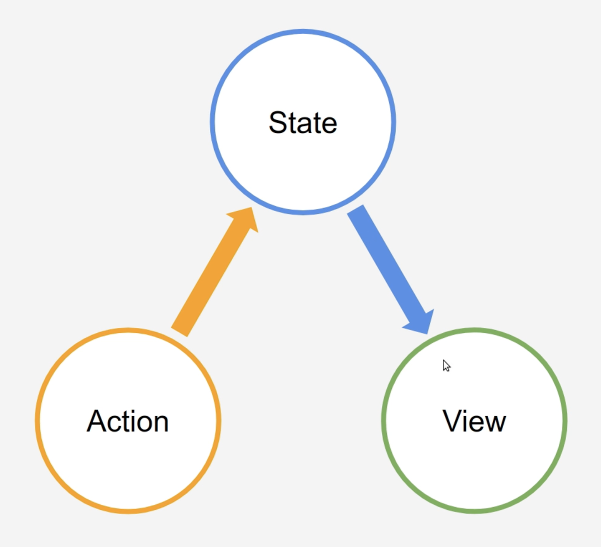

# Ui framework

## File name:

### immutable-flow.js

Flow: action -> state -> view

Pros: simple one way data flow

Cons: all time rerender all DOM elements

### virtual-dom.js

Simple sync virtual dom and real dom

Pros: doesn't re render all DOM element, just spot update DOM element

### virtual-dom-json.js

Description of DOM elements in JSON format

More declarative approach to create DOM element

### virtual-dom-jsx.js

VDom implements the “Factory” pattern, in this case it is primitive

Pros: Concisely writing DOM elements using our VDom than using JSON.

### virtual-dom-jsx-react.js

Added react and react-dom to project

### virtual-dom-jsx-react-add-jsx.js

Added babel at the top script of index.html for jsx
